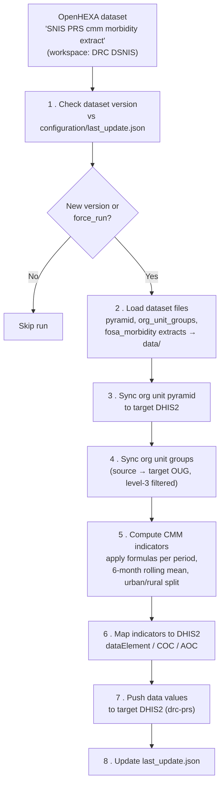

## DHIS2 CMM Morbidity DS Pipeline

### Overview

This pipeline computes **CMM** (*Consommation Moyenne Mensuelle* — Average Monthly Consumption) morbidity indicators for malaria (MII, TDR, SP, ASAQ1-4, ALU1-4, AI60, AS100) at facility (FOSA) level, and pushes the results to the target DHIS2 instance (`drc-prs`).

Raw inputs (org unit pyramid, org unit groups, and monthly `fosa_morbidity` data element extracts) are read from the OpenHEXA dataset **"SNIS PRS cmm morbidity extract"** (`snis-prs-cmm-extract`) in the **DRC DSNIS** workspace — populated by an upstream extraction pipeline. This pipeline only *consumes* that dataset; it does not query DHIS2 directly for raw data.

Ticket: [SAN-126](https://bluesquare.atlassian.net/browse/SAN-126) (old pipeline) · Repo: [BLSQ/openhexa-pipelines-drc-prs](https://github.com/BLSQ/openhexa-pipelines-drc-prs)

### Parameters

| Parameter | Code | Type | Default | Description |
|---|---|---|---|---|
| Start date | `start_date` | str (YYYYMM) | *(from config)* | First period to compute. Defaults to today minus `NUMBER_MONTHS_WINDOW` months (see `push_config.json`). |
| End date | `end_date` | str (YYYYMM) | *(from config)* | Last period to compute. Defaults to last month. |
| Run org units sync | `run_ou_sync` | bool | `True` | Aligns the org unit pyramid and org unit groups on the target DHIS2 before computing indicators. Recommended. |
| Push data | `run_push_data` | bool | `True` | Pushes the computed indicators to the target DHIS2. |
| Load dataset files | `load_ds_files` | bool | `True` | Downloads the latest pyramid / org unit groups / raw extract files from the source dataset. |
| Force run | `force_run` | bool | `False` | Runs the pipeline even if no new dataset version was detected. |

Both dates are clamped to a minimum of `201701` and validated so that `start_date <= end_date`.

### Workflow

#### Step by step

1. **Check dataset version** — compares the source dataset's latest version timestamp to `configuration/last_update.json`. If nothing changed and `force_run` is off, the pipeline stops here.
2. **Load dataset files** *(`load_ds_files`)* — downloads the pyramid, org unit groups, and per-period `fosa_morbidity` extracts listed in the dataset's manifest, saved as parquet under `data/`.
3. **Sync org unit pyramid** *(`run_ou_sync`)* — aligns the source org unit pyramid onto the target DHIS2 structure (`DHIS2PyramidAligner`).
4. **Sync org unit groups** *(`run_ou_sync`)* — for each source→target group pair in `sync_config.json`, diffs org unit membership (restricted to level-3 *Zones de Santé*) and PUTs the update to the target DHIS2 group if it changed.
5. **Compute CMM indicators** — for each period in the requested range, builds a `CMM_WINDOW_MONTHS` rolling window (default 6) of prior months, applies the indicator formulas from `cmm_config.json` to each month's raw extract (with a dedicated urban/rural branch based on descendants of the `OUG_URBAN` group), then averages across the window. Results are written to `data/cmm_morbidity/fosa_morbidity/cmm_morbidity_<period>.parquet`.
6. **Map indicators** — translates each CMM indicator code (e.g. `MII`, `ASAQ1`) into its DHIS2 `dataElement` / `categoryOptionCombo` / `attributeOptionCombo` UIDs, using `CMM_MAPPINGS` in `push_config.json`.
7. **Push data** *(`run_push_data`)* — pushes the mapped values to the target DHIS2 via `DHIS2Pusher`, honoring `IMPORT_STRATEGY`, `DRY_RUN` and `MAX_POST`.
8. **Update last run timestamp** *(`run_push_data`)* — records the dataset's latest version timestamp so the next run can detect whether new data has arrived.

### Computed indicators

Malaria CMM codes, defined by the formula tree in `cmm_config.json` (`CMM_SETTINGS.FORMULAS`):

`MII`, `TDR`, `SP`, `AI60`, `AS100`, `ASAQ1`-`ASAQ4`, `ALU1`-`ALU4`

Each formula is a small expression tree (`sum` / `multiply` / `constant` / `if orgUnitInGroupDescendant`) evaluated against the raw `fosa_morbidity` data elements, with different coefficients for FOSA under an urban *Zone de Santé* (`OUG_URBAN`) vs. rural ones.

### Configuration

| File | Purpose |
|---|---|
| `configuration/push_config.json` | `SETTINGS` (target connection, import strategy, dry run, max post, default date window, source dataset ID) and `CMM_MAPPINGS` (CMM code → DHIS2 dataElement/COC/AOC). |
| `configuration/sync_config.json` | `ORG_UNITS.UIDS` and `ORG_UNIT_GROUPS` (source → target org unit group IDs to sync). |
| `configuration/cmm_config.json` | `CMM_SETTINGS`: `EXTRACT_UID` (raw extract name), `OUG_URBAN` (urban group ID), `CMM_WINDOW_MONTHS`, and `FORMULAS` per indicator. |
| `configuration/last_update.json` | Generated/updated by the pipeline; last processed dataset version timestamp. |

### Expected results

- Raw inputs cached as parquet under `data/pyramid/`, `data/org_unit_groups/`, `data/extracts/data_elements/fosa_morbidity/`.
- One computed indicator file per period under `data/cmm_morbidity/fosa_morbidity/cmm_morbidity_<YYYYMM>.parquet`.
- Org unit pyramid and org unit groups on the target DHIS2 kept aligned with the source.
- CMM indicator values pushed as data values to the target DHIS2 at FOSA level (unless `DRY_RUN` is `true` in `push_config.json`, or `run_push_data` is `False`).
- `configuration/last_update.json` updated to the latest processed dataset version.
- Logs per task under `logs/ou_sync/`, `logs/oug_sync/`, `logs/push/`.

### Notes

- Re-runs are cheap by default: if the source dataset hasn't produced a new version, the pipeline exits early. Use `force_run` to bypass this.
- `push_config.json.SETTINGS.DRY_RUN` should stay `true` while validating a new period or formula change, before pushing for real.
